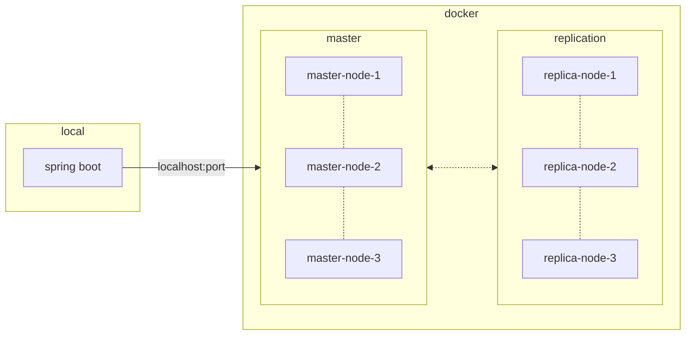

# Redis Cluster, Docker Compose, and Spring Boot

최근 한 프로젝트를 맡게 되면서 Redis Cluster를 사용할 기회가 생겼다.

원래부터 Redis 사용 경험이 적었다.
생각해 보면 애초에 DB 연동 경험이 턱없이 부족한 것 같다.
이미 환경설정이 끝난 상태에서 조작하는 정도로나 사용했다.

기존에 사용하던 Redis 구성은 Standalone 혹은 Sentinel 방식의 구성이었다.
Sentinel이 HA를 보장한다고 나왔지만, HA 구성에 대한 부하테스트 경험이 없었다.

새로 맡게된 프로젝트인 만큼 욕심도 났다.
그러나 Redis Cluster 구성에는 관여할 수 없는 상황에 처했다.
개발계 구성에도 한계가 있어서 WSL 환경의 Docker로 구성해서 테스트 하고자 했다.
하지만, WSL도 별도 권한 신청이 필요해서 너무 귀찮았다.
그래서 따로 개인 노트북 환경에서 테스트를 했고, 진행하면서 정리할 것들을 적기로 했다.

발생한 이슈는 다음과 같다.

1. Redis Cluster 구성 방법
2. Docker Network 설정 방법
3. local에서 띄운 Spring Boot와 Dockerized Redis Cluster 연동 방법

## 1. Redis Cluster 구성 방법

우선 Docker Compose를 사용했다. 역시 자료가 많았다.
Redis Cluster 띄우는 데 큰 이슈는 없었다.

다만, Container별 IP를 부여한 경험은 없었다.
IP 설정이 필수는 아닐 수도 있지만, 흥미로워서 사용해서 해결하고 싶었다.
그러나 여기서부터 고통이 시작됐다.

## 2, Docker Network 설정 방법

Docker Network 환경에 대해서는 컨셉 정도 이해하고 있었다.
Bridge, IPAM 등의 세부 설정 경험은 없었지만, 얼추 그러려니 했다.

Spring Boot에서 단일 노드 Redis는 연결이 워낙 쉬워 그 환경에서 개발은 얼추 끝낸 상태였다.
이제 Redis Cluster만 연결해서 설정하는 부분만 남은 상태였다.
하지만 이상하게도, 1번에서 설정한 IP로 연결이 되지 않았다.

`localhost`에서 `172.18.0.*/24`로 아무리 ping을 날려도 pong 메시지를 받을 수 없었다.
단순히 생각했어야 했는데, 저 IP 그룹에 요청을 직접 날릴 수 있다고 착각했다.
Docker Container 간 통신을 위한 네트워크에 끼어들 생각에 매몰됐다.
이후 port는 열렸으니 거기에 맞게 사용하면 될 것이었다.

## 3. local에서 띄운 Spring Boot와 Dockerized Redis Cluster 연동 방법

1번에서 IP 설정을 고수할 필요가 없겠구나 싶었다.
그래서 IP를 제거하면서 설정을 하려니, 말이 안 됐다.
클러스터 노드 간 통신을 하려면 해당 컨테이너의 IP를 알아야 클러스터링이 되는데 말이다.

IP 설정은 그대로 두고, 그러면 이제 Spring Boot에서 localhost로 보내면 되겠지 싶어 연결을 시도했다.
하지만 localhost로 열심히 연결해도, Spring Boot는 계속 1번에서 지정한 IP로 자동 인식되었다.
분명 하드코딩으로 `localhost`로 지정했는데, 어떻게 알았는지 `172.18.0.*`로 인식했다.

그래서 결국 이건 Redis Node에서 특정값을 뱉는 것으로 추론했다.
redis config 파일에서 cluster announce ip와 같은 설정이 있었다.
지정하지 않을 경우 해당 노드의 IP로 전달하는 것으로 추측됐다.
이걸 localhost로 연결하고, docker compose up을 다시 때리니까 아예 클러스터가 올라오지 않았다.
node 간 계속 localhost로 연결을 시도하는 것이다.

그렇다면, spring boot 설정을 다시 파야 한다는 것으로 방향이 정해졌다.
spring boot redis client resource 설정에서 DNS resolver 등의 설정을 할 수 있다는 것을 알게 되었다.
spring에서 초기 연결은 `localhost`으로 연결되었지만, redis에서는 스스로의 IP를 계속 전달한다.
그래서 spring은 계속해서 해당 IP로 요청을 처리할 테지만, 네트워크 환경 상 접근할 수 없는 IP이다.
따라서 DNS resolver를 통해 announce ip를 가로채 원하는 host(`localhost`)로 요청을 보내게끔 설정이 필요하다.



```java
    @Bean
    public RedisConnectionFactory clusterRedisConnectionFactory() {
        List<String> redisNodes = Arrays.asList("localhost:7001", "localhost:7002", "localhost:7003");
        RedisClusterConfiguration redisClusterConfiguration = new RedisClusterConfiguration(redisNodes);
        redisClusterConfiguration.setMaxRedirects(1);

        ClusterTopologyRefreshOptions clusterTopologyRefreshOptions = ClusterTopologyRefreshOptions.builder()
                .enableAllAdaptiveRefreshTriggers()
                .enablePeriodicRefresh(Duration.ofSeconds(5))
                .build();
        ClientOptions clientOptions = ClusterClientOptions.builder()
                .topologyRefreshOptions(clusterTopologyRefreshOptions)
                .build();

        MappingSocketAddressResolver resolver = MappingSocketAddressResolver.create(
                DnsResolvers.UNRESOLVED,
                hostAndPort -> {
                    if (hostAndPort.getHostText().startsWith("172.18")) {
                        return HostAndPort.of("localhost", hostAndPort.getPort());
                    }
                    return hostAndPort;
                });

        ClientResources clientResources = ClientResources.builder()
                .socketAddressResolver(resolver)
                .build();

        LettuceClientConfiguration clientConfiguration = LettuceClientConfiguration.builder()
                .readFrom(ReadFrom.UPSTREAM_PREFERRED)
                .clientResources(clientResources)
                .clientOptions(clientOptions)
                .build();

        return new LettuceConnectionFactory(redisClusterConfiguration, clientConfiguration);
    }
```

```yaml
version: '3'

services:
  redis-master-1:
    image: redis:alpine
    container_name: redis-master-1
    volumes:
      - ./config/redis-master-1.conf:/usr/local/etc/redis/redis.conf
    command: redis-server /usr/local/etc/redis/redis.conf
    ports:
      - 7001:7001
      - 17001:17001
    networks:
      redis_cluster:
        ipv4_address: 172.18.0.101

  redis-master-2:
    image: redis:alpine
    container_name: redis-master-2
    volumes:
      - ./config/redis-master-2.conf:/usr/local/etc/redis/redis.conf
    command: redis-server /usr/local/etc/redis/redis.conf
    ports:
      - 7002:7002
      - 17002:17002
    networks:
      redis_cluster:
        ipv4_address: 172.18.0.102

  redis-master-3:
    image: redis:alpine
    container_name: redis-master-3
    volumes:
      - ./config/redis-master-3.conf:/usr/local/etc/redis/redis.conf
    command: redis-server /usr/local/etc/redis/redis.conf
    ports:
      - 7003:7003
      - 17003:17003
    networks:
      redis_cluster:
        ipv4_address: 172.18.0.103

  redis-replica-1:
    image: redis:alpine
    container_name: redis-replica-1
    volumes:
      - ./config/redis-replica-1.conf:/usr/local/etc/redis/redis.conf
    command: redis-server /usr/local/etc/redis/redis.conf
    ports:
      - 8001:8001
      - 18001:18001
    networks:
      redis_cluster:
        ipv4_address: 172.18.0.201

  redis-replica-2:
    image: redis:alpine
    container_name: redis-replica-2
    volumes:
      - ./config/redis-replica-2.conf:/usr/local/etc/redis/redis.conf
    command: redis-server /usr/local/etc/redis/redis.conf
    ports:
      - 8002:8002
      - 18002:18002
    networks:
      redis_cluster:
        ipv4_address: 172.18.0.202

  redis-replica-3:
    image: redis:alpine
    container_name: redis-replica-3
    volumes:
      - ./config/redis-replica-3.conf:/usr/local/etc/redis/redis.conf
    command: redis-server /usr/local/etc/redis/redis.conf
    ports:
      - 8003:8003
      - 18003:18003
    networks:
      redis_cluster:
        ipv4_address: 172.18.0.203

  redis-cluster-entry:
    image: redis:alpine
    container_name: redis-cluster-entry
    command: redis-cli --cluster create 172.18.0.101:7001 172.18.0.102:7002 172.18.0.103:7003 172.18.0.201:8001 172.18.0.202:8002 172.18.0.203:8003 --cluster-yes --cluster-replicas 1
    depends_on:
      - redis-master-1
      - redis-master-2
      - redis-master-3
      - redis-replica-1
      - redis-replica-2
      - redis-replica-3
    networks:
      redis_cluster:

networks:
  redis_cluster:
    driver: bridge
    ipam:
      driver: default
      config:
        - subnet: 172.18.0.0/24
```

```conf
# redis.conf
port 7001
cluster-enabled yes
cluster-config-file node.conf
cluster-node-timeout 5000
appendonly yes
```

위와 같이 구성 후 구동 중인 master 노드 하나 다운 후 replica 중 한 노드가 master로 승격된 것을 확인했다.
cluster를 전부 내린 후 다시 올렸을 때 알아서 붙고 커넥션 맺는 부분도 확인됐다.

redis HA 구성이 목표이긴 했으나, docker 공부를 더 많이 하게 된 상황이 되어버렸다.
