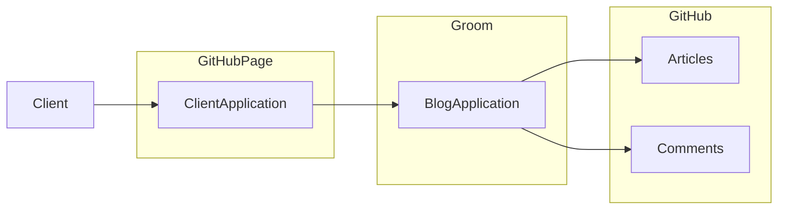

# Blogging

## TODO

- [ ] javascript fetch 시 외부 origin 사용해도 CORS 이슈 발생하지 않는지 확인
- [ ] GitHub API 등록 및 공식문서 톺아보기

## Architecture

```mermaid
flowchart LR
  subgraph GitHubPage
    ClientApplication
  end

  subgraph Groom
    BlogApplication
  end

  subgraph GitHub
    Articles
    Comments
  end

  Client --> ClientApplication
  ClientApplication --> BlogApplication
  BlogApplication --> Articles
  BlogApplication --> Comments
```
