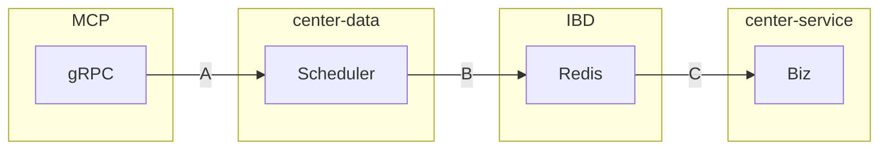

# 2024년 센터 워크샵

## 할당된 주제

1. EVS 2.0
2. OEM/Routo/Mappy/Global - 각 시스템 효율적 운영 방안 검토

## 1. EVS 2.0



```text
A: EV live data (1 min)
B: refined live data (1 min)
C: refined live data (each a search transaction)
```

- MCP의 gRPC 채택 이유는 센터검색과 경로탐색에 대한 고려 없이 단말에 차분 데이터 제공을 위해 단말 제공 최적 방안만 검토된 것으로 추측
- 강동현 연구원에게 gRPC에서 Kafka로 프로토콜 검토 요청했으나 힘들 것 같다는 응답
- 기존 DB View로 제공받던 데이터의 형태가 많이 달라져, 일일이 모든 충전소에 요청을 날려 충전기 정보를 한땀한땀 만들어야 함

## 2. OEM/Routo/Mappy/Global - 각 시스템 효율적 운영 방안 검토

### 데이터 관점

- 독립적인 데이터 생성 파이프라인 구성 - 현재도 독립적으로 색인 구축 중
- 데이터 중심 설계에서 벗어나 서비스 중심 설계 필요 - 이 서비스에 데이터가 필요하니 XXX 이름의 데이터 구성
- 스키마는 검색 서비스 모듈에 맞게 구성 - 지금 당장 변경하자는 말 X, 앞으로는 서비스 중심적으로 생각하자

### 서비스 관점

- [검증, 검색, 확장] 단계로 분리 필요
- 검증: HTTP 요청 검증, 플랫폼 특화 사양 검증
- 검색: 순수 POI 검색
- 확장: 표출 사양 충족, CP 데이터 추가 등

### 형상관리 관점

- Nexus 구축해서 모듈마다 Repository 분리가 최선이나, 멀티 모듈 사용이 현실적임
- 각 플랫폼별 독립적인 모듈로 관리 - conflict 최소화, 구동되는 Application 경량화, 모듈별 책임 명확
- [검색 도메인 모듈 + 공통 모듈 + 플랫폼 모듈] = 하나의 Biz Application

### 운영 관점

- CI/CD 파이프라인 구성이 최선이나, 케파와 자원 부족
- 각 플랫폼별 정업 담당자 선출 - OEM/Routo/Global
